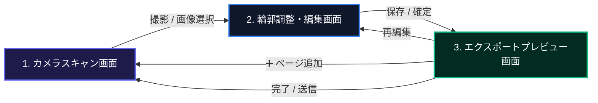

# Webドキュメントスキャナー (DocScan)

本ドキュメントは、iPhone (Safari) などのモバイル端末を主要ターゲットとし、ホーム画面に追加して完全オフラインで動作するクライアントサイド完結型PWA（Progressive Web App）ドキュメントスキャンアプリケーション **DocScan** の統合仕様書および開発・利用ガイドです。

すべての画像補正、OCR解析、およびPDF生成を端末内（ブラウザ内）で完結させることで、高速動作、高いプライバシー保護、およびサーバーレス運用を実現しています。

---

## 🚀 主要機能と特徴

### 1. AIによる超軽量・高速四隅境界検出 (DocCornerNet LEAN)
- **1.9MB の超軽量モデル**: `scanic-ml` に同梱されている SimCC ベースの四隅直接回帰モデル (`doc_seg.ort`) を採用。ブラウザ上でのモデル読み込みが劇的に速くなりました。
- **座標の直接回帰推論**: 入力 `224x224` (NHWC, RGB) から四隅の正規化座標 `[1, 8]` (TL, TR, BR, BL) を直接出力。従来の二値マスクに対する重い OpenCV.js Contour 近似処理が不要になり、約 `10ms` 前後での超高速推論を実現しています。
- **画面全体の誤検出を遮断する面積＆マージンフィルター**: 書類が写っていない時に画面外周を囲む巨大な枠線（誤検出）が出るのを防ぐため、検出面積が画面全体の 85% を超える場合（Shoelace面積公式）、または 4 つの角すべてが画面の端（5%マージン）に張り付いている場合は、誤検出として自動で非表示化します。また、信頼度しきい値を `0.45` に引き上げ曖昧な誤検出を防止。

### 2. 徹底的な CORS / COEP 回避とスレッドハング対策
- **WASM 実行スレッド数を 1 に固定**: ローカル開発時の自己署名HTTPS証明書警告や一部ブラウザのセキュリティ制限によって Web Worker の初期化処理がブロックされてフリーズする問題を防ぐため、WASM スレッド数を `1` に固定。
- **JSEP (WebGPU) の排除による 350KB の軽量化**: Vite のエイリアス設定 (`resolve.alias`) を用いて WebGPU 依存のない純粋な WASM 専用の最小モジュール（`ort.wasm.min.mjs`）へ強制マッピング。メイン JS バンドルサイズが **1,064KB ➔ 716KB** に激減し、26.8MBの巨大な `jsep.wasm` のフェッチと 404 エラーを完全解決。
- **25MB制限以下のファイルをローカル配信**: 13.4MB の `ort-wasm-simd-threaded.wasm` のみを `public/` に配置して同一オリジンから配信し、Cloudflare Pages の 25MB デプロイ容量制限を満たしつつ CORS エラーを回避。

### 3. PWA用キャッシュクリア＆アプリ再起動
- **画面左下のフローティング復旧ボタン**: PWA環境下でモデルのキャッシュが破損したりロードが進まなくなった場合の復旧手段として、画面の左下にキャッシュクリア＆ハードリロードボタン（RefreshCw）を配置。
- **ワンクリック完全クリーンアップ**: ブラウザのすべての Cache Storage の削除、Service Worker の登録解除、および強制的なリロードを一括で実行し、初期クリーン状態に安全に復旧できます。

### 4. インスタント・シングルセッションフロー（UI/UXの極小化）
- **起動即カメラ**：アプリ起動と同時に直接カメラプレビュー（Finder）が立ち上がります。
余計なトップページやドキュメント一覧画面は撤去され、起動から撮影までを最速で行えます。
- **アサートフリー＆ダイアログフリー**：エクスポート完了時や、保存・編集時の確認用ポップアップ（`window.confirm` や `window.prompt`）をすべて排除し、手数を最小限にしました。
- **プレビューからのシームレスな複数ページ追加**：編集確定後は即座にプレビュー画面に進み、必要に応じてグリッドの「➕ ページ追加」カードからいつでもカメラに戻ってページを追加できます。
- **非同期OCRと遷移間ローディング**：編集確定時のOCR処理をバックグラウンドで非同期に実行します。
解析中は、直前のスキャン画像が背景にうっすらとシネマティックに映り込んだ磨りガラス調スピナー画面を表示し、ユーザーインターフェース of フリーズを完全に防止します。
- **保存形式の永続化**：PDFやJPEGといった出力保存形式の選択状態を `localStorage` で永続化し、次回起動時も同じ形式をデフォルトにします。

### 2. 進化した超高画質ドキュメント補正（OpenCV.js）
- **除算 (Division) による影の完全除去**：従来の差分（引き算）方式から、背景の明るさムラに対して割り算でアプローチする除算フィルタへと全面刷新しました。
画像の端に黒い影や黒枠などの極端な外れ値が写り込んでいても、文字全体のコントラストが一切引っ張られることなく、背景だけを完璧に真っ白に平滑化します。
- **平均輝度に応じた動的ガンマとしきい値の自動調整**：OpenCV.jsを用いて画像全体の平均輝度を解析します。
露出不足の暗い画像はガンマを下げて明るく補正し、逆に明るい画像はコントラストを高めて文字を引き締めます。
階調を潰さずに中間トーン（文字のインク）のみを漆黒へ強力に引き締め、コピー機でスキャンしたかのように鮮明で美しい文字を描画します。
- **色彩解析による最適なフィルタの自動選択**：撮影画像のHSV空間における彩度の平均値を解析し、カラーフィルタとドキュメントフィルタを自動で判定して初期適用します。
- **カラー画像コントラスト最適化**：カラーモード時も、RGBチャンネルを分割し、個別にレベル＆ガンマ補正を適用して再合成します。
インクの色鮮やかさを完全に保ったまま、薄暗い部屋の影を白く飛ばします。

### 3. Laplacian分散による手ブレ・ピンボケ防止キャッシュバッファ
- **CPU負荷 97.5% 削減の超高速ピント判定**：OpenCV.js を用いたピント（シャープネス）測定用の画像を長辺 300px に超軽量リサイズしてから処理します。
AIエッジ評価の計算時間を 1ms 未満に短縮し、カメラプレビューの 60fps 動作を完全に維持します。
- **高密度 8フレーム・ベストショット選択**：枠線検出中、50ms間隔で高解像度（長辺 1920px）のフレームを直近 8枚（約0.4秒分）キャッシュし続けます。
シャッターが切られた瞬間、その8枚の中からラプラシアン分散スコアが最も高い（ブレやピンボケが極限まで少ない）最高品質の1枚を自動選別して確定します。

### 4. クライアントサイド PP-OCRv4 (ONNX/WASM) による高精度文字認識
- **AI専用の裏側前処理パイプライン**：保存・出力用の画像の見た目（カラー等）に関わらず、OCR処理の瞬間だけは、裏側で「除算影消し ➔ コントラスト最大化 ➔ アンシャープマスク輪郭シャープネス強調」を施した超解像度画像を生成してAIへ入力します。
これにより、かすれた極小文字も漏らさず検知します。
- **推論パラメータのチューニング**：解析解像度の限界を `2240px` へ拡大し、文字切り出し比率を `1.8` に拡張しました。
漢字のはね・はらいの切れによる誤認識を徹底防止します。

### 5. サーチャブルPDFの「爆縮」軽量化
- **フォント埋め込みゼロ**：2MB近くあるカスタム日本語フォントの埋め込みを完全に排除しました。
標準フォントである `Helvetica` を登録し、透明（`opacity: 0.0`）で画像の上に文字レイヤーとして重ね合わせます。
- **PDFサイズの最適化（無駄なフォント非埋め込み）**：日本語のコピペ・検索・選択機能を維持しつつ、PDF化時の画像圧縮（1920px JPEG）を最適化することで、A4一枚あたり約300KB〜600KB前後の軽量なファイルサイズに抑えています。

### 6. ネイティブ級ピンチズーム・パン・ダブルタップ Lightbox
- **無制限のピンチズーム**：CSSレイアウト境界の干渉を受けないよう、画像タグ自体に直接 transform スケールを適用し、境界を越えた自由な拡大縮小を実現しました。
- **`passive: false` によるジェスチャー奪還**：ブラウザ標準の画面バウンスやスクロールスクラップを無効化し、1本指でのドラッグ移動（パン）や、2点ピンチ、ダブルタップによる瞬時ズーム（2.5倍）をiOS上でも滑らかに動作させます。
- **境界判定と動作の改善**：ズーム中の移動可能限界領域を画像の表示サイズに合わせて動的に計算し、指の動きに吸い付くように追従します。
- **iOS Safe Area 対応**：閉じるボタンをズーム変形エリアの外側に配置し、かつ `env(safe-area-inset-top)` を組み込むことで、iPhone のステータスバーやノッチ（切り欠き）に被らない安全な配置を自動保証します。

### 7. メモリ節約とクラッシュ防止（1920px リサイズ）
- **最大寸法の最適化**：エクスポートする全画像は、出力形式を問わず最大辺が 1920px になるように自動でリサイズ処理が行われます。
これによりモバイル端末でのメモリ消費を抑え、システムのクラッシュや共有時の遅延を防止します。
- **確率的ディザリングによる減色**：PNG形式での出力時は 8bit（256色）に量子化減色され、バンディングノイズを防ぐための確率的ディザリングが適用されます。

---

## 🛠️ 技術スタック

- **ランタイム / パッケージマネージャー**：Bun
- **フロントエンド**：React (TypeScript / Vite)
- **画像処理 (4隅検出・台形補正・フィルタ)**：OpenCV.js (WebAssembly)
- **四隅境界検出エンジン**：DocCornerNet LEAN (1.9MB SimCCモデル / ONNX Runtime Web)
- **OCRエンジン**：pure-onnx-ocr (PaddleOCRv6 small ONNX/WASM版 / ローカル配信)
- **PDF生成・合成**：pdf-lib
- **PWAセットアップ**：vite-plugin-pwa (runtimeCachingによるオフラインモデルキャッシュ)
- **スタイリング**：Vanilla CSS (Tailwind依存なしの最適化設計、iOS Safe Area完全対応)

---

## 📦 起動・開発手順

### 1. 依存関係のインストール
```bash
bun install
```

### 2. 開発サーバーの起動
```bash
bun run dev --host
```
※スマートフォン実機（iOS Safari 等）から確認する場合は、ローカルネットワーク経由（例：`http://192.168.x.x:5173`）でアクセスしてください（Vite起動時にコンソールに出力されるIPアドレスです）。

### 3. プロダクションビルドの生成
```bash
bun run build
```
ビルド完了後、生成された `dist` ディレクトリ内の全ファイルをホスティングサービス（Cloudflare Pages, Netlify等）にデプロイして運用できます。

---

## ⚙️ 画面遷移とUIアーキテクチャ

単一のドキュメント作成セッションに特化した、無駄のないリニア（直線的）な遷移設計です。



### ディレクトリ構造（主要ファイル）

```text
src/
├── components/
│   ├── CameraScanner.tsx      # カメラプレビューと枠線検出の描画
│   ├── DocumentEditor.tsx     # トリミングとフィルタ処理のUI
│   ├── ExportPreview.tsx      # PDF/画像プレビューとエクスポートUI
│   ├── OpenCvInitializer.tsx  # OpenCV.js ロード待機画面
│   ├── ThumbnailGrid.tsx      # スキャン済みページのサムネイル一覧
│   ├── ZoomableImage.tsx      # ピンチズーム・パン対応の画像表示モーダル
│   ├── useCameraStream.ts     # カメラの開始・停止・解像度管理フック
│   └── useCropHandles.ts      # トリミングハンドルのドラッグ制御フック
├── utils/
│   ├── db.ts                  # スキャンセッションのIndexedDB永続化
│   ├── imageExportHelper.ts   # リサイズ、ディザリング、ファイル生成ユーティリティ
│   ├── ocrHelper.ts           # ONNX Runtimeを用いたOCR実行ラッパー
│   ├── opencvHelper.ts        # OpenCV.jsを用いた台形補正・フィルタ処理
│   ├── pdfHelper.ts           # pdf-libを用いたサーチャブルPDFの生成
│   └── useScanSession.ts      # スキャンセッション全体の状態遷移を管理するフック
```

### 各画面・モジュールの詳細

#### 1. カメラスキャン画面 (`CameraScanner.tsx`)
- 起動と同時に `useCameraStream` を介して背面カメラを起動します。
- ノッチ部分を美しく隠す磨りガラス風ヘッダーバッジ統合UIと、右上にバージョンバッジ（`v0.1`）を表示します。
- AI (DocCornerNet LEAN) でドキュメントの4隅をリアルタイム検出し、画面上にグリーンのポリゴンを描画します。境界検出は AI モデルのみで動作し、OpenCV へのフォールバックは行いません。
- コントロールバーを「左端：キャッシュクリア、中：シャッター、右：ライブラリ選択」の同一高丸ボタンで統一し、完全な左右対称性を実現。閉じるボタンは右上に「✕」ボタンとしてフローティング配置しています。
- シャッターボタン押下時に、直近 8フレームのキャッシュバッファから最も手ブレの少ない1枚を自動選別して確定します。

#### 2. 輪郭調整・編集画面 (`DocumentEditor.tsx`)
- `useCropHandles` により、台形補正を行う4つの頂点（ピン）を指先で微調整できます。
- ドラッグ時は指の影にならないよう、上部に高精細な **ルーペ（拡大鏡）** をポップアップ表示します。
- 「カラー / モノクロ / ドキュメント」の各フィルタ切り替えおよび90度回転に対応しています。
- 「確定」を押した瞬間、プレビュー画面のサムネイル部分に向かって画像が小さく吸い込まれていく **飛行トランジションアニメーション (`flyToPreviewGrid`)** が発火します。
- 戻るボタンを押した際は、フィルター適用画面からトリミング調整画面に戻る二段構えのナビゲーションです。

#### 3. エクスポートプレビュー画面 (`ExportPreview.tsx`)
- 裏側でOCR専用前処理および PaddleOCR WASM が非同期に起動します。
- ページの管理には `ThumbnailGrid` コンポーネントを使用し、ドラッグ可能な並び替えや追加・削除操作を受け付けます。
- サムネイルをクリックすると、`ZoomableImage` モーダルが立ち上がり、ピンチイン・アウトで画像の細部を確認できます。
- 最下部のアクションバーには「PDFダウンロード保存」と「共有」のボタンを縦2段に配置し、素早いアクセスを可能にしています。

---

## 🧠 主要アルゴリズムの仕組み

### A. 除算（Division）による照明ムラ・影の除去
文字が消えるほどの強力なカーネルサイズ（33x33）で元画像を膨張（`dilate`）させ、メディアンフィルタをかけることで、ドキュメントの「紙の地肌（背景輝度）」だけを推定した画像 $Bg$ を生成します。
この背景画像 $Bg$ で元画像 $Src$ を除算し、スケール $255$ をかけることで、紙の上のあらゆるグラデーションの影が完全に消し飛び、元のインクのコントラスト比だけが正確に維持されます。
$$Dst(x, y) = \min\left(255, \frac{Src(x,y)}{Bg(x,y)} \times 255\right)$$

### B. 動的ガンマ補正 ＆ レベルストレッチ
影を除去した後の画像に対し、全体の平均輝度（Mean Value）に基づいて動的に算出されたしきい値 $minVal$ から $maxVal$ の範囲で明るさを線形伸縮し、さらに非線形ガンマ値 $\gamma$ を適用します。
これにより、背景のわずかなノイズは完全に白へと飛び、中間トーンの文字だけが階調を潰さずに濃く黒く引き締まります。
$$V_{out} = 255 \times \left( \frac{V_{in} - minVal}{maxVal - minVal} \right)^{\gamma}$$

ここで用いられるパラメータは、輝度解析によって以下のように変動します。
- **暗い画像（平均輝度 < 130）**：ガンマ値を下げて（最小 1.15）全体を明るくし、しきい値の下限（最小 15）を下げることで、文字の潰れを防止します。
- **明るい画像（平均輝度 >= 130）**：ガンマ値を上げて（最大 1.85）コントラストを高め、しきい値の上限（最大 235）を上げることで、文字をシャープに引き締めます。

### C. 色彩解析による自動フィルタ選定
撮影画像からHSV空間の彩度（S）チャンネルを取り出し、その平均値 $meanSat$ を算出します。
彩度の平均値がしきい値 15 を超える場合、画像はカラー情報（蛍光ペンのマーカーやスタンプなど）を含んでいると判定され、デフォルトでカラーフィルタが適用されます。
しきい値以下の場合は、ドキュメントフィルタ（モノクロ階調強調）が自動で選択されます。

### D. AI専用 OCR前処理（Unsharp Mask ＆ 2値クランプ）
OCRにかける前に、画像にガウシアンフィルタをかけ、元の画像から引くことで文字のエッジ成分（高周波）を抽出し、元の画像に加算するアンシャープマスキングを行います。
さらに、コントラストをしきい値 `70〜180`、ガンマ値 `2.0` で極端に最大化させてAIに入力することで、かすれやピンボケ文字に対するAIの文字認識能力を極限まで引き上げています。

### E. エクスポート時画像リサイズ ＆ 確率的ディザリング
端末のメモリ不足によるブラウザクラッシュや、ファイル送信時のネットワーク遅延を防ぐため、エクスポート出力画像は最大辺が 1920px になるよう `resizeCanvas` 処理が実行されます。
さらに、PNG形式での出力時は、8bit（256色：R3bit, G3bit, B2bit）に量子化されます。
このとき、激しい等高線状のブロックノイズ（カラーバンディング）を抑制するため、以下の確率的ディザリングアルゴリズムを各チャンネルに適用し、擬似的に豊かな階調を表現します。

$$R_{noise} = (\text{rand}() - 0.5) \times 36$$
$$G_{noise} = (\text{rand}() - 0.5) \times 36$$
$$B_{noise} = (\text{rand}() - 0.5) \times 85$$

各ピクセルの値は、これらのノイズを加算した上でそれぞれの代表値にクランプされて出力されます。

### F. AI四隅境界検出 (DocCornerNet LEAN) ＆ 誤検出フィルター
DocCornerNet LEAN モデルは、入力画像に対して4隅（左上: $TL$, 右上: $TR$, 右下: $BR$, 左下: $BL$）の正規化座標（$0.0 \sim 1.0$）を直接予測します。

#### 1. 検出面積による誤検出排除
誤って画面全体を囲うように検出されるのを防ぐため、四角形の面積 $S$ を以下の外積多角形面積公式（Shoelace公式）で計算します：

$$S = \frac{1}{2} \left| (x_{TL}y_{TR} - y_{TL}x_{TR}) + (x_{TR}y_{BR} - y_{TR}x_{BR}) + (x_{BR}y_{BL} - y_{BR}x_{BL}) + (x_{BL}y_{TL} - y_{BL}x_{TL}) \right|$$

正規化座標空間において $S > 0.85$ （画面全体の85%以上）を占める巨大な検出領域は、ドキュメントの誤検出とみなして非表示化（`null` 返却）します。

#### 2. 四隅の画面端張り付きの検出
各点が画面の外周端（マージン $margin = 0.05$）にすべて張り付いている状態を検出します：

- $TL$ が $(x < 0.05 \text{ 且つ } y < 0.05)$
- $TR$ が $(x > 0.95 \text{ 且つ } y < 0.05)$
- $BR$ が $(x > 0.95 \text{ 且つ } y > 0.95)$
- $BL$ が $(x < 0.05 \text{ 且つ } y > 0.95)$

4点すべてがこの条件を満たす場合、モデルが境界を検知できずに画面端へ飽和出力している状態とみなして、誤検出として排除します。
