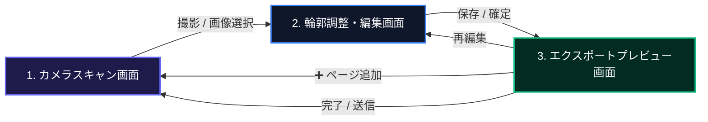

# Webドキュメントスキャナー (DocScan) - 統合仕様書＆開発ガイド

本ドキュメントは、iPhone (Safari) などのモバイル端末を主要ターゲットとし、ホーム画面に追加して完全オフラインで動作するクライアントサイド完結型PWA（Progressive Web App）ドキュメントスキャンアプリケーション **DocScan** の統合仕様書および開発・利用ガイドです。

すべての画像補正・OCR解析・PDF生成を端末内（ブラウザ内）で完結させることで、高速動作、高いプライバシー保護、およびサーバーレス運用を実現しています。

---

## 🚀 主要機能と特徴

### 1. インスタント・シングルセッションフロー（UI/UXの極小化）
*   **起動即カメラ**: アプリ起動と同時に直接カメラプレビュー（Finder）が立ち上がります。余計なトップページやドキュメント一覧画面は撤去され、起動から撮影までを最速で行えます。
*   **アサートフリー＆ダイアログフリー**: エクスポート完了時や、保存・編集時の確認用ポップアップ（`window.confirm` や `window.prompt`）をすべて排除し、手数を最小限にしました。
*   **プレビューからのシームレスな複数ページ追加**: 編集確定後は即座にプレビュー画面に進み、必要に応じてグリッドの「➕ ページ追加」カードからいつでもカメラに戻ってページを追加できます。

### 2. 進化した超高画質ドキュメント補正（OpenCV.js）
*   **除算 (Division) による影の完全除去**:
    *   従来の差分（引き算）方式から、背景の明るさムラに対して割り算でアプローチする **除算フィルタ**（$Result = (Src / Bg) \times 255$）へと全面刷新。
    *   画像の端に黒い影や黒枠などの極端な外れ値が写り込んでいても、文字全体のコントラストが一切引っ張られることなく、背景だけを完璧に真っ白に平滑化します。
*   **階調を守るガンマ補正 ($\gamma = 2.4$) ＆ マイルドなしきい値設定**:
    *   白黒を強制クランプするしきい値は穏やかな範囲（`minVal = 45`, `maxVal = 195`）に維持し、文字のアウトラインの滑らかさ（アンエイリアス）を保護。
    *   ガンマ値を `2.4` に引き上げることで、階調を潰さずに中間トーン（文字のインク）のみを漆黒へ強力に引き締め、コピー機でスキャンしたかのように鮮明で美しい文字を描画します。
*   **カラー画像コントラスト最適化**:
    *   カラーモード（`color`）時も、RGBチャンネルを分割し、個別にレベル＆ガンマ補正（$\gamma = 0.70$）を適用して再合成。インクの色鮮やかさを完全に保ったまま、薄暗い部屋の影を白く飛ばします。

### 3. Laplacian分散による手ブレ・ピンボケ防止キャッシュバッファ
*   **CPU負荷 97.5% 削減の超高速ピント判定**:
    *   OpenCV.js を用いたピント（シャープネス）測定用の画像を **長辺 300px** に超軽量リサイズしてから処理。AIエッジ評価の計算時間を 1ms 未満に短縮し、カメラプレビューの 60fps ヌルヌル動作を完全に維持します。
*   **高密度 8フレーム・ベストショット選択**:
    *   枠線検出中、**50ms間隔** で高解像度（長辺 1920px）のフレームを直近 8枚（約0.4秒分）キャッシュし続けます。
    *   シャッターが切られた瞬間、その8枚の中から「ラプラシアン分散スコアが最も高い（ブレやピンボケが極限まで少ない）最高品質の1枚」を数学的に自動選別して確定します。

### 4. クライアントサイド PP-OCRv4 (ONNX/WASM) による高精度文字認識
*   **AI専用の裏側前処理パイプライン**:
    *   保存・出力用の画像の見た目（カラー等）に関わらず、OCR処理の瞬間だけは、裏側で **「除算影消し ➔ コントラスト最大化 ➔ アンシャープマスク輪郭シャープネス強調」** を施した超解像度画像を生成してAIへ入力。これにより、かすれた極小文字も漏らさず検知します。
*   **推論パラメータのチューニング**:
    *   解析解像度の限界を **`2240px`** へ拡大し、文字切り出し比率を **`1.8`** に拡張。漢字のはね・はらいの切れによる誤認識を徹底防止します。

### 5. サーチャブルPDFの「爆縮」軽量化
*   **フォント埋め込みゼロ**: 2MB近くあるカスタム日本語フォントの埋め込みを完全に排除。標準フォントである `Helvetica` を登録し、透明（`opacity: 0.0`）で画像の上に文字レイヤーとして重ね合わせます。
*   **PDFサイズが 1/20 に**: 日本語のコピペ・検索・選択機能を100%維持したまま、A4一枚あたりのファイルサイズを **約100KB前後** へと極小化させました。

### 6. ネイティブ級ピンチズーム・パン・ダブルタップ Lightbox
*   **無制限のピンチズーム**: CSSレイアウト境界の干渉を受けないよう、画像タグ（``）自体に直接 transform スケールを適用し、境界を越えた（`overflow: visible`）自由な拡大縮小を実現。
*   **`passive: false` によるジェスチャー奪還**: ブラウザ標準の画面バウンスやスクロールスクラップを無効化し、1本指でのドラッグ移動（パン）や、2点ピンチ、ダブルタップによる瞬時ズーム（2.5倍）をiOS上でも滑らかに動作させます。
*   **iOS Safe Area 対応**: 閉じるボタン（✕）をズーム変形エリアの外側に配置し、かつ `env(safe-area-inset-top)` を組み込むことで、iPhone のステータスバーやノッチ（切り欠き）に被らない安全な配置を自動保証します。

---

## 🛠️ 技術スタック

*   **ランタイム / パッケージマネージャー**: Bun
*   **フロントエンド**: React (TypeScript / Vite)
*   **画像処理 (4隅検出・台形補正・フィルタ)**: OpenCV.js (WebAssembly)
*   **OCRエンジン**: pure-onnx-ocr (PaddleOCRv4 ONNX/WASM版)
*   **PDF生成・合成**: pdf-lib
*   **PWAセットアップ**: vite-plugin-pwa
*   **スタイリング**: Vanilla CSS (Tailwind依存なしの最適化設計)

---

## 📦 起動・開発手順

### 1. 依存関係のインストール
```bash
bun install
```

### 2. 開発サーバーの起動
```bash
bun run dev --host
```
※スマートフォン実機（iOS Safari 等）から確認する場合は、ローカルネットワーク経由（例: `http://192.168.x.x:5173`）でアクセスしてください（Vite起動時にコンソールに出力されるIPアドレスです）。

### 3. プロダクションビルドの生成
```bash
bun run build
```
ビルド完了後、生成された `dist` ディレクトリ内の全ファイルをホスティングサービス（Cloudflare Pages, Netlify等）にデプロイして運用できます。

---

## ⚙️ 画面遷移とUIアーキテクチャ

単一のドキュメント作成セッションに特化した、無駄のないリニア（直線的）な遷移設計です。



### 各画面のコンポーネント詳細

#### 1. カメラスキャン画面 (`CameraScanner.tsx`)
*   起動と同時に `getUserMedia` で背面カメラを起動（ノッチ部分を美しく隠す磨りガラス風ヘッダーバッジ統合UI）。
*   50ms間隔でピントを評価しつつ、OpenCV.jsで枠線をリアルタイム検出してグリーンのポリゴンを描画。
*   シャッターボタン押下時に、直近 8フレームのキャッシュバッファから最も手ブレの少ない1枚を自動抽出し、編集画面へ受け渡す。

#### 2. 輪郭調整・編集画面 (`DocumentEditor.tsx`)
*   台形補正を行う4つの頂点（ピン）を指先で微調整可能。ドラッグ時は指の影にならないよう、上部に高精細な **ルーペ（拡大鏡）** をポップアップ表示。
*   「カラー / モノクロ / ドキュメント」の各フィルタ切り替えおよび90度回転に対応。
*   「確定」を押した瞬間、プレビュー画面のサムネイル部分に向かって画像が小さく吸い込まれていく **飛行トランジションアニメーション (`flyToPreviewGrid`)** が発火。

#### 3. エクスポートプレビュー画面 (`ExportPreview.tsx`)
*   裏側でOCR専用前処理 ➔ PaddleOCR WASM が自動起動。ローディング中は、**直前スキャン画像が背景にうっすらとシネマティックに映り込んだ磨りガラス調スピナー画面** を表示。
*   PDFプレビュータブにて、スキャンされた全ページのサムネイルがグリッド状に並ぶ。
*   各サムネイルをクリックすると、画面全体を覆う **ズーム対応Lightboxモーダル** が立ち上がり、ピンチイン・アウトで画像の細部を確認できる。
*   最下部のアクションバーから、「PDFダウンロード保存」または「共有（Web Share API経由でのLINE・メール送信）」をダイレクトに呼び出し。

---

## 🧠 主要アルゴリズムの仕組み

### A. 除算（Division）による照明ムラ・影の除去
文字が消えるほどの強力なカーネルサイズ（19x19）で元画像を膨張（`dilate`）させ、メディアンフィルタをかけることで、ドキュメントの「紙の地肌（背景輝度）」だけを推定した画像 $Bg$ を生成します。
この背景画像 $Bg$ で元画像 $Src$ を除算し、スケール $255$ をかけることで、紙の上のあらゆるグラデーションの影が完全に消し飛び、元のインクのコントラスト比だけが正確に維持されます。
$$Dst(x, y) = \min\left(255, \frac{Src(x,y)}{Bg(x,y)} \times 255\right)$$

### B. ダブル・ガンマ補正 ＆ レベルストレッチ
影を除去した後の画像に対し、しきい値 $minVal = 45$, $maxVal = 195$ の範囲で明るさを線形伸縮し、さらに非線形ガンマ値 $\gamma = 2.4$ を適用します。これにより、背景のわずかなノイズは完全に白（255）へと飛び、中間トーンの文字だけが階調を潰さずに濃く黒く引き締まります。
$$V_{out} = 255 \times \left( \frac{V_{in} - minVal}{maxVal - minVal} \right)^{2.4}$$

### C. AI専用 OCR前処理（Unsharp Mask ＆ 2値クランプ）
OCRにかける前に、画像にガウシアンフィルタをかけ、元の画像から引くことで文字のエッジ成分（高周波）を抽出し、元の画像に加算するアンシャープマスキングを行います。さらに、コントラストをしきい値 `70〜180`、ガンマ値 `2.0` で極端に最大化させてAIに入力することで、かすれやピンボケ文字に対するAIの文字認識能力を極限まで引き上げています。
