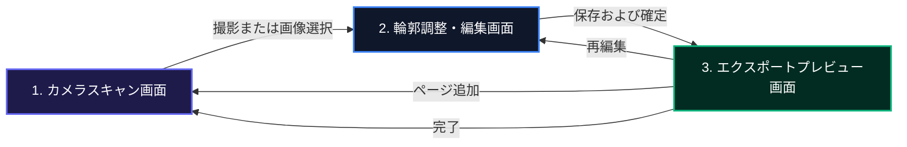

# Webドキュメントスキャナー (DocScan)

本リポジトリは、スマートフォンでの利用を想定したクライアントサイド動作のドキュメントスキャンアプリケーションです。
ホーム画面に追加して完全なオフライン環境で動作するPWA（Progressive Web App）として構築されています。
画像補正、OCR解析、PDF生成のすべての処理をブラウザ内で完結させることで、高いプライバシー保護とサーバーレス運用を実現します。

---

## 主要機能と特徴

### AIを用いた超軽量の四隅境界検出
`scanic-ml` に同梱された SimCC ベースの四隅回帰モデルである `doc_seg.ort`（1.9MB）を搭載しています。
入力画像からドキュメントの4隅の正規化座標を直接出力します。
従来のマスク出力に対する OpenCV.js の輪郭近似処理を排除し、およそ 10ms での境界検出を可能にしました。
ドキュメントが写っていない時の誤検出を防ぐため、検出面積が画面全体の85%を超える場合、または四隅すべてが画面端の5%領域に張り付いている場合は、誤検出として枠線を非表示にします。
誤検出を減らすため、信頼度しきい値は 0.45 に設定されています。

### CORSおよびCOEPの回避とスレッドハングの防止
ローカル開発時の自己署名証明書警告やセキュリティ制限によるスレッド生成のフリーズを防ぐため、WASM 実行時のスレッド数を 1 に制限しています。
Vite のエイリアス設定で WebGPU 依存のない最小モジュール（`ort.wasm.min.mjs`）へマッピングすることで、メインの JS バンドルサイズを 716KB までスリム化し、不要な WASM リクエストの発生を防止しました。
容量制限を満たす 13.4MB の `ort-wasm-simd-threaded.wasm` のみをローカルから同一オリジン配信し、オフライン動作を保証します。

### シングルセッションに特化した操作フロー
アプリ起動と同時に直接カメラプレビューが立ち上がります。
確認用のポップアップを排除し、撮影から確定までの手数を最小限にしました。
スキャン画像の追加や並び替えは、プレビュー画面からシームレスに実行できます。
エクスポートの保存形式の選択状態はローカルストレージに永続化されます。

### 除算フィルタによる影の除去
文字が消えない十分なカーネルサイズで膨張処理を適用し、ドキュメントの背景輝度を推定した画像を生成します。
この背景画像で元画像を除算することで、紙の上の影や光のムラを消去し、文字のコントラストを保ったまま背景を平滑化します。

### 露出量に応じたレベルストレッチとガンマ補正
画像の平均輝度を解析し、しきい値の範囲とガンマ値を動的に変更します。
暗い画像はガンマ値を下げて文字の潰れを防ぎ、明るい画像はガンマ値を上げてコントラストを高めることで、文字の視認性を向上させます。

### 手ブレとピンボケの防止バッファ
ピント判定用の画像サイズを 300px に縮小して処理することで、エッジ評価の計算時間を 1ms 未満に抑え、プレビューの 60fps 動作を維持します。
シャッターが押された際、直近の 8フレームのキャッシュからラプラシアン分散スコアが最も高いフレームを自動で選択して処理に回します。

### 日本語 OCR 解析用のアプローチ
OCR解析の直前に、裏側でアンシャープマスキングによるエッジ強調と、コントラストの最大化処理を適用します。
解析解像度の限界を 2240px に拡張し、文字の切れによる誤認識を防止します。

### サーチャブルPDF의容量最適化
カスタム日本語フォントの埋め込みを行わず、標準フォントである Helvetica を透明な文字レイヤーとして画像の上に重ね合わせます。
A4の1ページあたりおよそ 300KB から 600KB 前後のファイルサイズに抑えています。

### ジェスチャー操作対応のプレビュー
画像の transform スケールを直接操作することで、滑らかな拡大縮小を実現しました。
スクロールバウンスを無効化し、1本指でのドラッグ移動とダブルタップによる 2.5倍ズームに対応しています。
ズーム中の移動可能限界領域を画像の表示サイズに合わせて動的に計算し、iPhone の Safe Area にも対応しています。

### メモリ消費の抑制と減色処理
エクスポート画像は最大辺が 1920px になるように自動でリサイズされます。
PNG形式での出力時は 8ビット（256色）に量子化され、カラーバンディングを防ぐための確率的ディザリングが適用されます。

---

## 技術スタック

- **パッケージマネージャー**：Bun
- **フロントエンド**：React および Vite
- **画像処理**：OpenCV.js
- **四隅境界検出**：DocCornerNet LEAN (ONNX Runtime Web)
- **OCRエンジン**：pure-onnx-ocr (PaddleOCRv6 small)
- **PDF生成**：pdf-lib
- **PWA支援**：vite-plugin-pwa
- **スタイリング**：Vanilla CSS

---

## 起動と開発の手順

### 1. 依存関係のインストール
```bash
bun install
```

### 2. 開発用サーバーの起動
```bash
bun run dev --host
```
モバイル端末から確認する場合は、ローカルネットワーク経由のアドレスにアクセスしてください。

### 3. ビルドの生成
```bash
bun run build
```
ビルド完了後、`dist` ディレクトリ内のファイルをホスティングサービスにデプロイします。

---

## 画面遷移と UI アーキテクチャ

単一のドキュメント作成セッションに特化した直線的な遷移設計です。



### ディレクトリ構造

```text
src/
├── components/
│   ├── CameraScanner.tsx      # カメラプレビューと枠線検出の描画
│   ├── DocumentEditor.tsx     # トリミングとフィルタ処理のUI
│   ├── ExportPreview.tsx      # PDFおよび画像のプレビューとエクスポートUI
│   ├── OpenCvInitializer.tsx  # OpenCV.js ロード待機画面
│   ├── ThumbnailGrid.tsx      # スキャン済みページのサムネイル一覧
│   ├── ZoomableImage.tsx      # ピンチズームとパン対応の画像表示モーダル
│   ├── useCameraStream.ts     # カメラの開始と停止および解像度の管理フック
│   └── useCropHandles.ts      # トリミングハンドルのドラッグ制御フック
├── utils/
│   ├── db.ts                  # IndexedDBによるデータ永続化
│   ├── imageExportHelper.ts   # リサイズおよびディザリング処理
│   ├── ocrHelper.ts           # ONNX Runtimeを用いたOCRの実行
│   ├── opencvHelper.ts        # OpenCV.jsを用いた台形補正とフィルタ処理
│   ├── pdfHelper.ts           # pdf-libを用いたサーチャブルPDFの生成
│   └── useScanSession.ts      # セッション状態の遷移管理フック
```

### 各画面の詳細

#### 1. カメラスキャン画面 (`CameraScanner.tsx`)
`useCameraStream` を介して背面カメラを起動します。
ヘッダーバッジUIの右上にバージョンバッジを表示します。
AI でドキュメントの4隅をリアルタイム検出し、画面上にポリゴンを描画します。境界検出は AI モデルのみで動作し、OpenCV へのフォールバックは行いません。
コントロールバーには、閉じるボタン（または対称性のためのダミースペース）、シャッターボタン、ライブラリ選択ボタンが配置されます。
シャッターボタン押下時に、キャッシュバッファから手ブレの最も少ないフレームを自動選別します。

#### 2. 輪郭調整・編集画面 (`DocumentEditor.tsx`)
`useCropHandles` により、台形補正の頂点を微調整します。
ドラッグ時は指の影で見えなくならないよう、上部に拡大鏡を表示します。
各種フィルタ切り替えと90度回転に対応しています。
確定時に、プレビュー画面へ向けて画像が小さく吸い込まれていくアニメーションを適用しています。

#### 3. エクスポートプレビュー画面 (`ExportPreview.tsx`)
裏側で OCR 用の前処理と OCR 推論が非同期で起動します。
`ThumbnailGrid` を使用してサムネイルの並び替え、追加、削除が行えます。
サムネイルをクリックすると、`ZoomableImage` モーダルで画像の細部を確認できます。
最下部に保存と共有のボタンを配置しています。

---

## 主要アルゴリズムの仕組み

### A. 除算フィルタによる照明ムラと影の除去
文字が消えないカーネルサイズ（33x33）で元画像を膨張させ、背景の輝度だけを推定した画像 $Bg$ を生成します。
この背景画像 $Bg$ で元画像 $Src$ を除算し、スケール $255$ をかけることで、紙の上の影を消去し、元の文字のコントラスト比を維持します。
$$Dst(x, y) = \min\left(255, \frac{Src(x,y)}{Bg(x,y)} \times 255\right)$$

### B. 動的ガンマ補正とレベルストレッチ
影を除去した後の画像に対し、平均輝度に基づいて動的に算出されたしきい値 $minVal$ から $maxVal$ の範囲で明るさを線形伸縮し、さらに非線形ガンマ値 $\gamma$ を適用します。
これにより、背景のわずかなノイズを白へと飛ばし、文字だけを濃く引き締めます。
$$V_{out} = 255 \times \left( \frac{V_{in} - minVal}{maxVal - minVal} \right)^{\gamma}$$

パラメータは輝度解析によって以下のように変動します。
- **暗い画像（平均輝度 < 130）**：ガンマ値を下げて全体を明るくし、しきい値の下限を下げることで、文字の潰れを防止します。
- **明るい画像（平均輝度 >= 130）**：ガンマ値を上げてコントラストを高め、しきい値の上限を上げることで、文字をシャープに引き締めます。

### C. 色彩解析による自動フィルタ選定
画像から HSV 空間 of 彩度（S）チャンネルを取り出し、平均値 $meanSat$ を算出します。
彩度の平均値がしきい値 15 を超える場合、画像はカラー情報を含んでいると判定され、デフォルトでカラーフィルタが適用されます。
しきい値以下の場合は、ドキュメントフィルタが選択されます。

### D. OCR用前処理
OCRにかける前に、画像にガウシアンフィルタをかけ、元の画像から引くことで文字のエッジ成分を抽出し、元の画像に加算するアンシャープマスキングを行います。
さらに、コントラストをしきい値 `70〜180`、ガンマ値 `2.0` で極端に最大化させてAIに入力することで、文字の認識率を高めています。

### E. 確率的ディザリングによる減色
PNG形式での出力時は 8ビット（256色：R3bit, G3bit, B2bit）に量子化されます。
カラーバンディングを抑制するため、以下の確率的ディザリングアルゴリズムを各チャンネルに適用し、擬似的に階調を表現します。

$$R_{noise} = (\text{rand}() - 0.5) \times 36$$
$$G_{noise} = (\text{rand}() - 0.5) \times 36$$
$$B_{noise} = (\text{rand}() - 0.5) \times 85$$

各ピクセルの値は、これらのノイズを加算した上でそれぞれの代表値にクランプされて出力されます。

### F. AI四隅境界検出と誤検出フィルター
DocCornerNet LEAN モデルは、入力画像に対して4隅（左上: $TL$, 右上: $TR$, 右下: $BR$, 左下: $BL$）の正規化座標を直接予測します。

#### 1. 検出面積による誤検出排除
誤って画面全体を囲うように検出されるのを防ぐため、四角形の面積 $S$ を以下の外積多角形面積公式（Shoelace公式）で計算します：

$$S = \frac{1}{2} \left| (x_{TL}y_{TR} - y_{TL}x_{TR}) + (x_{TR}y_{BR} - y_{TR}x_{BR}) + (x_{BR}y_{BL} - y_{BR}x_{BL}) + (x_{BL}y_{TL} - y_{BL}x_{TL}) \right|$$

正規化座標空間において $S > 0.85$ を占める巨大な検出領域は、ドキュメントの誤検出とみなして非表示化します。

#### 2. 四隅の画面端張り付きの検出
各点が画面の外周端（マージン $margin = 0.05$）にすべて張り付いている状態を検出します：

- $TL$ が $(x < 0.05 \text{ 且つ } y < 0.05)$
- $TR$ が $(x > 0.95 \text{ 且つ } y < 0.05)$
- $BR$ が $(x > 0.95 \text{ 且つ } y > 0.95)$
- $BL$ が $(x < 0.05 \text{ 且つ } y > 0.95)$

4点すべてがこの条件を満たす場合、モデルが境界を検知できずに画面端へ飽和出力している状態とみなして、誤検出として排除します。
